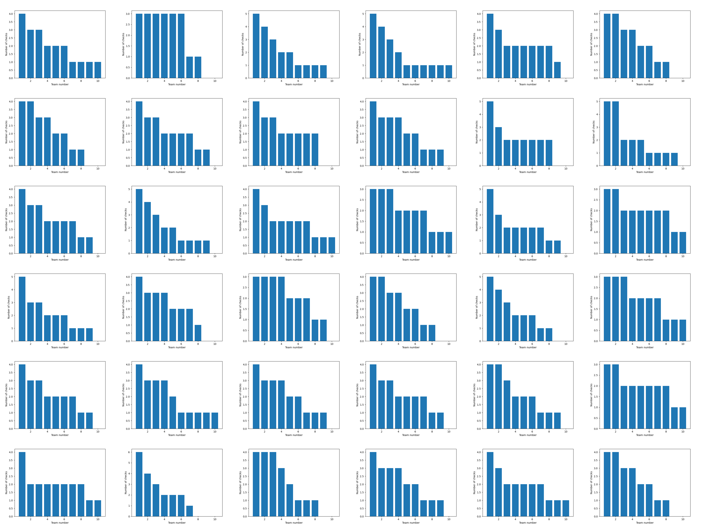

# Formula 1 Plank check statistics confusion
## Background
The seem to be a lot of confusion around the image below. The image regards FIA and which teams have been selected for a plank check.

The discussion is around wether the checks have truly been random, and if a random generator can have generated rusults like the one shown in the graph.

## Results
First result:

The 36 next results:

## Code
The code consists of two files. 

`main.py`: This file generates the 36 graphs. The graphs are made by randomly selecting four cars to be checked. Which teams were selected is saved by taking the car number, dividing it by two and ignoring the decimals. This process is done 18 times and the total checks per team is plotted. The whole generation and plotting process is done once per graph, 36 times. The graphs are saved as .png images in the `graphs` folder.

`grid_image.py`: Splice the outputted graphs into one bigger image.

`look_for_distribution.py`: Look for a specific dirtribution. Run the simulation again and again until found. Print how many tries it took. Can be an exact match or not.

## out.png
`out.png` was the first graph the program produced. It is saved in case anyone is wondering if the order of the graphs being generated is significant.